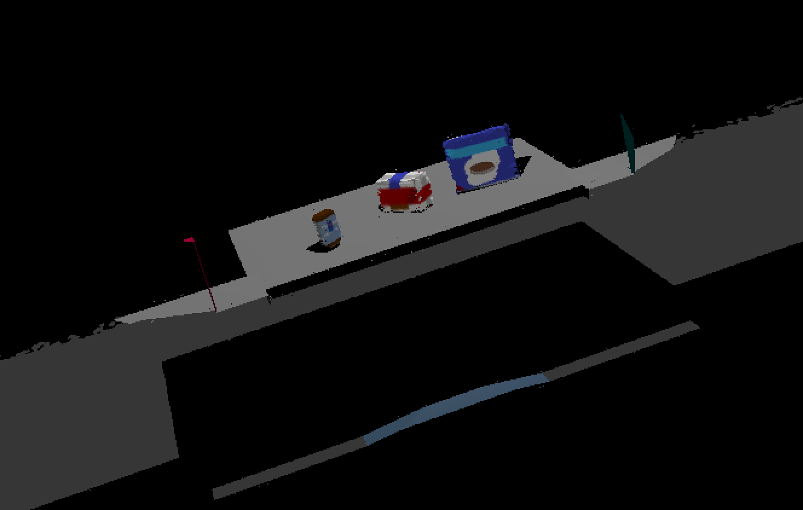
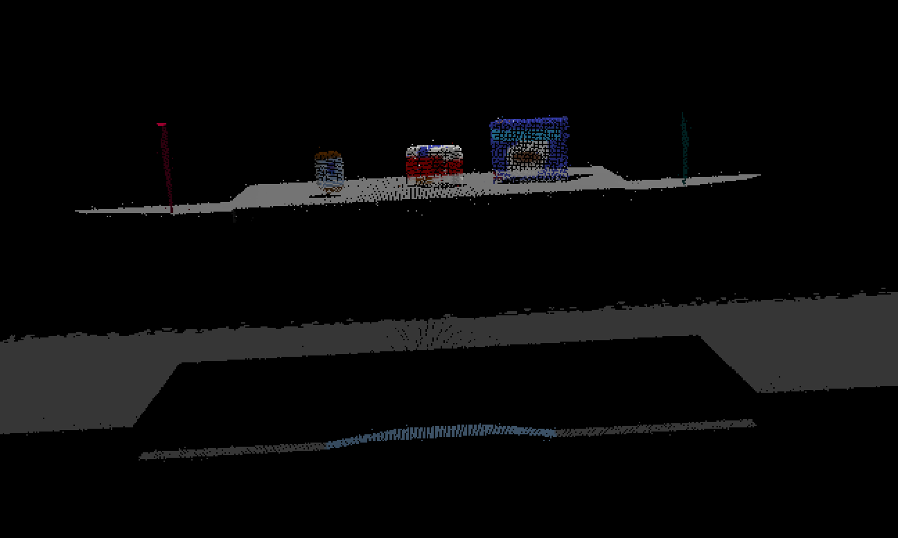
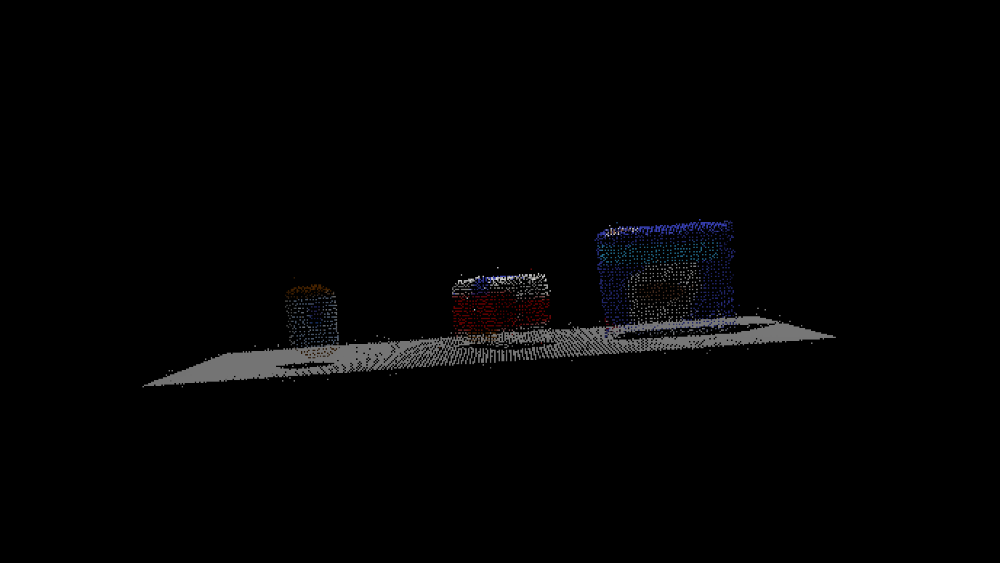
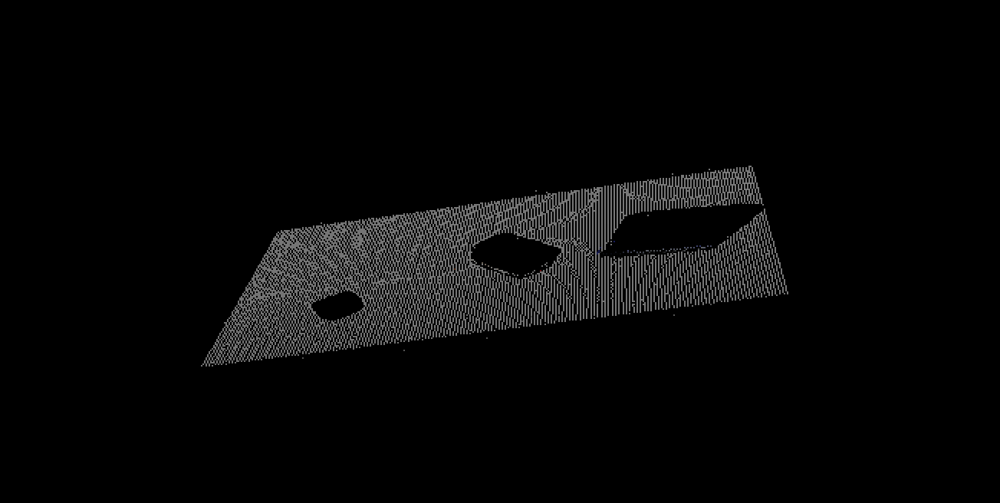
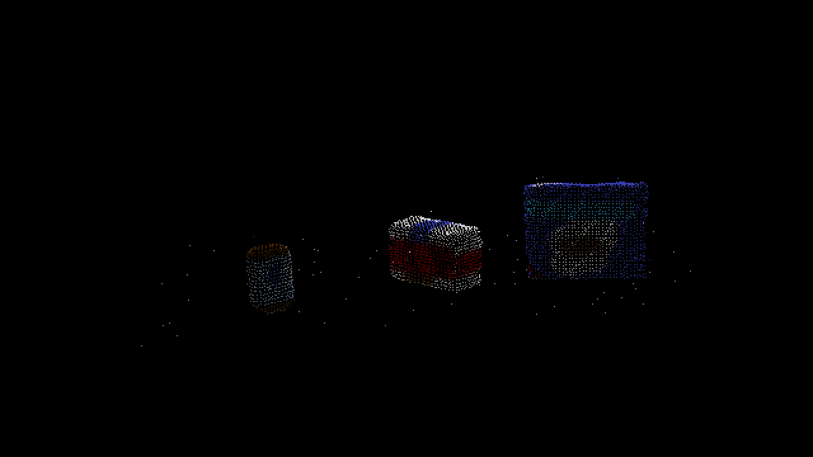
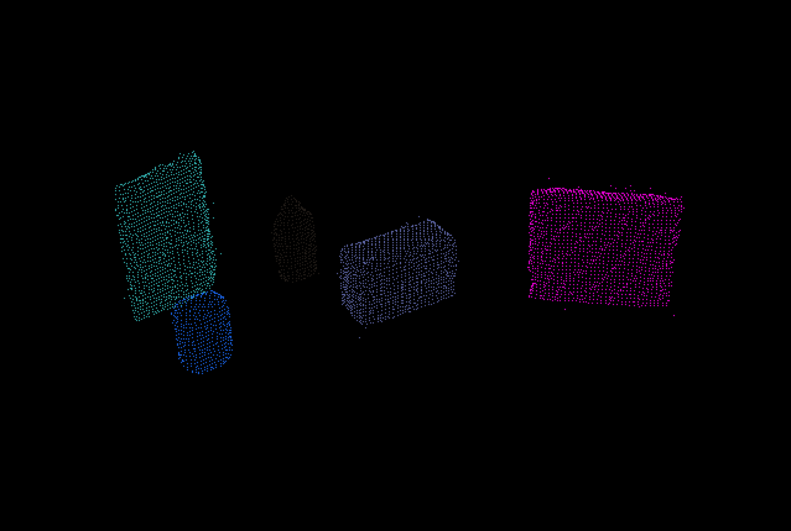
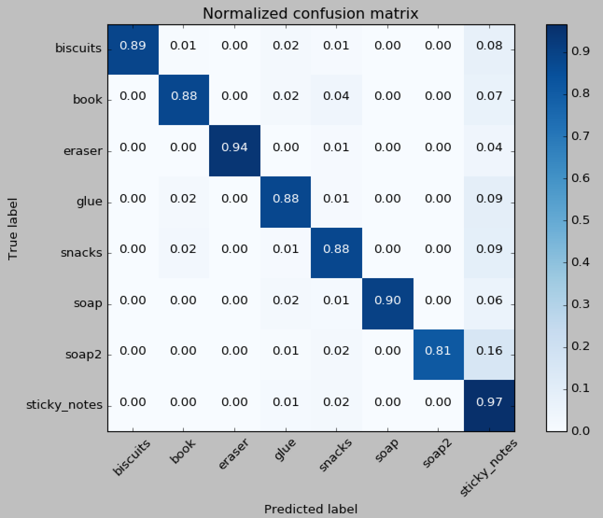

[](https://www.udacity.com/robotics)

## 3D Perception Project
### Writeup by Ayo Adedeji
---
#### Instructions on how to setup Gazebo, ROS and other dependencies can be found [here](./project_setup.md).

## [Rubric](https://review.udacity.com/#!/rubrics/1067/view) Points
---
### Perception Pipeline Implementation of [RoboND Exercises 1, 2 and 3](https://github.com/udacity/RoboND-Perception-Exercises)
#### 1. Complete Exercise 1 steps | Pipeline for statistical outlier, voxel grid, passthrough filtering and RANSAC plane fitting implemented:

Below images are based on [test1.world](https://github.com/theayoad/RoboND-Perception-Project/blob/master/pr2_robot/worlds/test1.world)

#### Statistical Outlier Removal (k = 50, x = .05) 
* The pcl.StatisticalOutlierRemovalFilter computes the mean distance of each point to k number of neighbors. All points whose mean distance (to neighbors) is greater than the global_mean_distance + x * global_std_dev are considered to be outliers and removed from the point cloud.

<p align="center"> </p>

```python
# Statistical Outlier Filtering
outlier_filter = point_cloud.make_statistical_outlier_filter()
outlier_filter.set_mean_k(50) # num of neighboring points to analyze
x = .05 # threshold scale factor
outlier_filter.set_std_dev_mul_thresh(x) # outlier > global_mean_distance + x*global_std_dev
point_cloud_filtered = outlier_filter.filter()
```

#### Voxel Grid Downsampling (leaf_size = .005)
* The pcl.VoxelGridFilter class assembles a local 3D grid over a given PointCloud and downsamples the point cloud data based on user specified voxel grid leaf size.

<p align="center">  </p>

```python
# Voxel Grid Downsampling
vox = point_cloud_filtered.make_voxel_grid_filter()
leaf_size = .005 # voxel (leaf) size
vox.set_leaf_size(leaf_size, leaf_size, leaf_size)
point_cloud_filtered = vox.filter()
```

#### PassThrough  (y=[-.42, .42], z=[.6, 1.8])
* The pcl.PassThroughFilter class removes points from point cloud that do not meet constraints / limits for a particular field of the point type.
* Z-axis filtering in range of [.6, 1.8] ensures only table + objects data make up point cloud
* Y-axis filtering in range of [-.42, .42] prevents bin recognition

<p align="center">  </p>

```python
# PassThrough Filter
passthrough = point_cloud_filtered.make_passthrough_filter()
passthrough.set_filter_field_name('y')
passthrough.set_filter_limits(-0.42, 0.42) # prevent bin recognition
point_cloud_filtered = passthrough.filter()
passthrough = point_cloud_filtered.make_passthrough_filter()
passthrough.set_filter_field_name('z')
passthrough.set_filter_limits(0.6, 1.8) # only table + objects
point_cloud_filtered = passthrough.filter()
```

#### RANSAC Plane Fitting (dist=.01) 
* The pcl.Segmentation class runs sample consensus methods and models. Specifically, the RANSAC algorithm involves iterated hypothesis and verification of point cloud data: a hypothetical shape of the specified model (i.e pcl.SACMODEL_PLANE) is generated  by selecting a minimal subset of n-points at random and evaluating the corresponding shape to model fit. The images below the result of plane fitting: 
* Points that correspond to plane (inliers) are extracted to yield point cloud of table
* Points that do not correspond to plane (outliers) are extracted to yield point cloud of tabletop objects.

<p align="center">  </p>
<p align="center">  </p>

```python
# RANSAC Plane Segmentation
seg = point_cloud_filtered.make_segmenter()
seg.set_model_type(pcl.SACMODEL_PLANE)
seg.set_method_type(pcl.SAC_RANSAC)
seg.set_distance_threshold(.01)
inliers, coefficients = seg.segment()
# Extract inliers and outliers
cloud_table = point_cloud_filtered.extract(inliers, negative=False)
cloud_objects = point_cloud_filtered.extract(inliers, negative=True)
```


#### 2. Complete Exercise 2 steps | Pipeline including clustering for segmentation implemented.  

#### DBSCAN / Euclidean Clustering (dist_tol=.025, min_cluster_size=10, max_cluster_size=5500) 
* The DBSCAN algorithm creates clusters by grouping data points that are within some threshold distance (dist_tol) from the other data points. Cluster inclusion depends on euclidean distance (hence, alternative name Euclidean clustering instead of DBSCAN). There are minimum and maximum cluster size limits: if a point has at least (min_cluster_size - 1) neigbhors within dist_tol than that point is a "core member", otherwise point is designated an "edge member". If a point has no neigbors within dist_tol, that point is designated an outlier (essentially treated as noise)
* Specific values for threshold distance (dist_tol), min_cluster_size, and max_cluster_size were derived via trial and error. If min_cluster_size is too large, clustering performance degrades drastically. If dist_tol is too large or too small, clustering performance degrades drastically. I found that there was a little more room for error when it came to defining max_cluster_size
* Below image is based on [test2.world](https://github.com/theayoad/RoboND-Perception-Project/blob/master/pr2_robot/worlds/test2.world)

<p align="center">  </p>

```python
# Euclidean Clustering
white_cloud = XYZRGB_to_XYZ(cloud_objects)
tree = white_cloud.make_kdtree()
ec = white_cloud.make_EuclideanClusterExtraction()
ec.set_ClusterTolerance(0.025) # distance tolerance
ec.set_MinClusterSize(10)
ec.set_MaxClusterSize(5500)
ec.set_SearchMethod(tree)
cluster_indices = ec.Extract() # extract indices for each of the discovered clusters
# Create Cluster-Mask Point Cloud to visualize each cluster separately
cluster_color = get_color_list(len(cluster_indices))
color_cluster_point_list = []
for j, indices in enumerate(cluster_indices):
    for i, indice in enumerate(indices):
        color_cluster_point_list.append([
            white_cloud[indice][0],
            white_cloud[indice][1],
            white_cloud[indice][2],
            rgb_to_float(cluster_color[j])
        ])
cluster_cloud = pcl.PointCloud_PointXYZRGB()
cluster_cloud.from_list(color_cluster_point_list)
# Convert PCL data to ROS messages
ros_cluster_cloud = pcl_to_ros(cluster_cloud)
# Publish ROS messages
pcl_cluster_pub.publish(ros_cluster_cloud)
```


#### 2. Complete Exercise 3 Steps | Object recognition implemented (extract features, train SVM):

#### Extract Features
* I captured 300 features for each objects listed in [pick_list_1.yaml](./pr2_robot/config/pick_list_1.yaml), [pick_list_1.yaml](./pr2_robot/config/pick_list_2.yaml), and [pick_list_3.yaml](./pr2_robot/config/pick_list_3.yaml), using [capture_features.py](./sensor_stick_scripts/capture_features.py)
* (pro tip) Set gazebo gui attribute to false in training.launch file (within sensor_stick package) to speed up rate of feature capture 

##### Compute Color Histograms
* In process of reading RGB data from the point clouds from each snapshot, I converted RGB data to HSV (hue-saturation-value) color space to increase robustness of object recognition (RGB is sensitive to changes in brightness etc.)
* I used 32 bins, so roughly 12.5% of color data would fall into each bin (initially, I experimented with larger number of bins but didn't see increase in performance enough to justify increase in processing time larger number bins brought on)

```python
 # Compute color histograms
  nbins = 32
  bins_range = (0, 256)
  channel_1_hist = np.histogram(channel_1_vals, bins=nbins, range=bins_range)
  channel_2_hist = np.histogram(channel_2_vals, bins=nbins, range=bins_range)
  channel_3_hist = np.histogram(channel_3_vals, bins=nbins, range=bins_range)
  # Concatenate and normalize the histograms
  hist_features = np.concatenate((
      channel_1_hist[0], channel_2_hist[0], channel_3_hist[0])).astype(np.float64)
  normed_features = hist_features / np.sum(hist_features)
  # Return the feature vector
  return normed_features 
```

##### Compute Normal Histograms
* Surface normal values all fall in range of -1 to 1. Likewise, as opposed to bins_range of (0,256) used for color histograms, for normal histograms I set a bins_range of (-1,1)

```python
# Compute normal histograms (just like with color)
nbins = 32
bins_range = (-1, 1)
norm_x_hist = np.histogram(norm_x_vals, bins=nbins, range=bins_range)
norm_y_hist = np.histogram(norm_y_vals, bins=nbins, range=bins_range)
norm_z_hist = np.histogram(norm_z_vals, bins=nbins, range=bins_range)
# Concatenate and normalize the histograms
hist_features = np.concatenate((
    norm_x_hist[0], norm_y_hist[0], norm_z_hist[0])).astype(np.float64)
normed_features = hist_features / np.sum(hist_features)
# Return the feature vector
return normed_features
```

#### Train SVM
* Sklearn has a nifty function called [GridSearchCV](http://scikit-learn.org/stable/modules/generated/sklearn.model_selection.GridSearchCV.html) that allows one to specify a range of C values, gamma values, and kernels, and essentially extract the classifier (and set of params) that perform best for given dataset. I used this function to help me settle on a sigmoid kernel for trained SVM. GridSearchCV ultimately recommended a sigmoid classifer with C=93 and gamma=.001 with accuracy of 93% for the 2400 feature [training_set.sav](./output/training_set.sav)
* However, I found that although the classifier recommended by GridSearchCV had high accuracy rates in training (and performed perfectly in test1.world and test2.world) the classifier only correctly recognized 7/8 objects in test3.world (consistently misclassified glue for biscuits)
* Using the classifier recommendation given by GridSearchCV as a basepoint and tinkering around a bit with the values for C and gamma, I settled on a sigmoid classifier with param values of C=40 and gamma=.0001. This classifier has slighly lower accuracy (90%) than the classifier recommended by GridSearchCV but performs perfectly in all three worlds.
* I am guessing the classifer recommended by GridSearchCV slightly suffered from overfitting. Likewise, it makes sense by final classifier performed better because I lowered C (which controls tradeoff between smooth decision boundary and classifying points correctly; higher C results in greater emphasis on classifying points correctly) and gamma (which defines how far the influence of a single training example reaches; higher gamma results in greater emphasis on fitting close points)

##### Normalized Confusion Matrix (Sigmoid, C=.40, gamma=.0001, accuracy=90%)
<p align="center"> </p>


